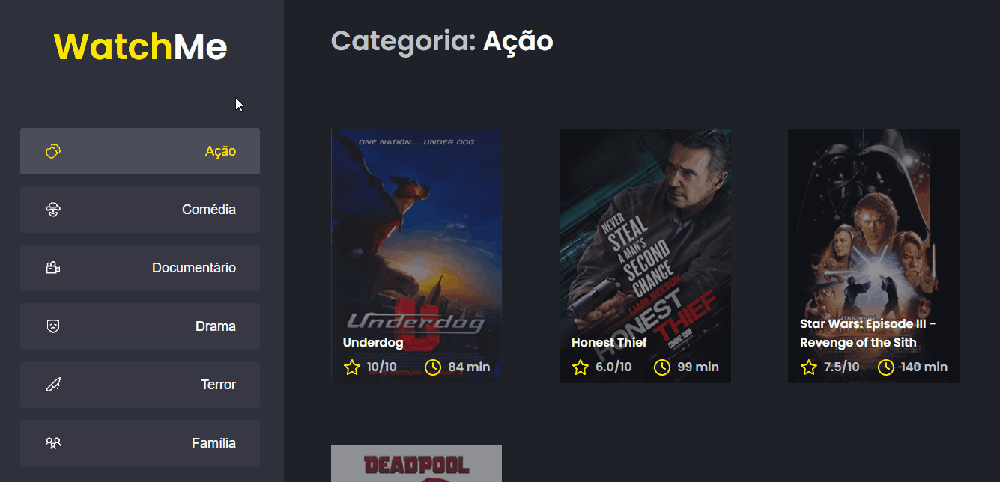

<h1 align="center">
  <a href="">
    WatchMe
  </a>
</h1>

<b>WatchMe</b> foi desenvolvido com ReactJS, uma aplicação dinâmico mostrando os filmes de acordo com suas categorias!

   
  
  

  

  

  

  

Um desafio da Rocketseat onde tivemos que componentizar a aplicação e compartilhar um estado entre dois componentes! 🚀🚀🚀

